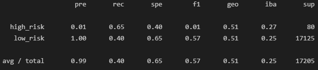

# Credit Risk Analysis

## Project Overview
The purpose of this analysis is to build multiple supervised machine learning algorithms that will predict cases of fraud for credit transactions. These algorithms will help loan companies predict high risk transactions and to optimize lending.

## Resources
- Software: 
	- Python 3.7.10
	- Jupyter Notebook
	- Pandas Library
	- sklearn Library
	- imblearn Library
- Resources:
	- resources/LoanStats_2019Q1.csv

## Analysis and Results

### RandomOverSampling:

The accuracy score for the RandomOverSampling model is 60.7%. 
The precision for high risk loans is extremely small at 1%, and the recall value is only at 57%, giving an f1 score of only 1%. Low risk loans however have a very high precision and recall at 100% and 64% respectively, giving a 78% f1 score. This is probably due to the imbalanced nature of the data set with low risk loans being highly represented in the data.

### SMOTE:

The accuracy score for the SMOTE model is slightly better than the previous one, at 64%. The precision for both high risk and low risk, as well as the recall for low risk remain almost exactly the same as before (1%, 100%, 63% respectively). The recall value for high risk loans is slightly higher at 65%. The f1 scores for both remain almost identical.

### Cluster Centroids:

Using our first undersampling model, Cluster Centroids, yielded worse results, giving us an accuracy score of 52.5%. The precision for both high and low risk remain identical to the previous models. The recall for high risk is 65% and low risk is 40%. The f1 scores for high risk is 1% and for low risk is 57%.

### SMOTEEN:

Using our first combination model of over and under sampling, the SMOTEEN model yielded the best results so far with an accuracy of 64.7%. The only notable difference here is the recall value of high risk loans were noticeably higher at 75%.

### Random Forest:

Our first ensemble ML model, Random Forest, is much better than previous models, giving an accuracy of 65.6%. The precision, recall, and f1 of low_risk loans were all at 100%. High risk loans had a high precision of 76%, however the recall is very low at 31%, giving us an f1 score of only 44%.

### Easy Ensemble:

The final model we will be using is the easy ensemble model. This model outperformed all other ML algorithms by far, giving us an accuracy score of 92.8%. However, the precision for detecting high risk loans is extremely low at 7%.

## Summary

Overall, all the ML models used here were relatively weak at predicting credit risk. The easy ensemble model gave us the best accuracy and very high recall value, which would allow us to detect most high risk loans. Unfortunately, the precision for the easy ensemble model is still extremely low, which would falsely tag many low risk loans. Therefore I don't believe any of these models should be used as they currently are. 